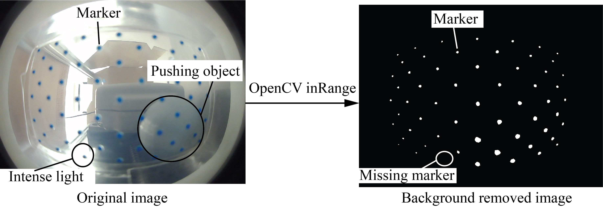
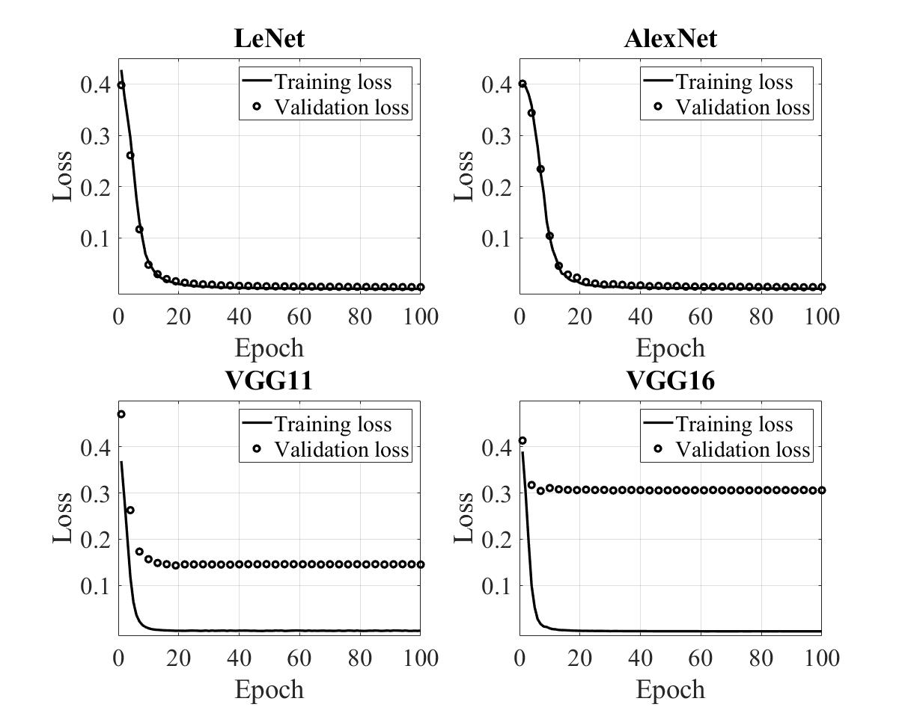

# Deep Learning-based Force Sensing for Robot Finger
This work proposes a method for force sensing using deep learning models for robot fingers having transparent soft skin. The system can successfully remove the background noise in the photos containing the deformation information of the fnger skin. To achieve this, the *inRange* function of OpenCV is ultilized with the below boundary values for the three color channels.
|              | Hue            | Saturation    | Value         |
| :---         |     :---:      |         :---: |         :---: |
| High boundary| 141            | 255           | 255           |
| Low boundary | 54             | 139           | 33            |

Here is an example of an image captured by the camera inside the finger before and after background removal.

The images are then used as the input for a deep learning model, which predicts the position and magnitude of the exerted force. Four deep learning models are trained with the training data set to realize an optimal architecture. The selected models are LeNet (http://yann.lecun.com/exdb/publis/pdf/lecun-01a.pdf), AlexNet (https://papers.nips.cc/paper/4824-imagenet-classification-with-deep-convolutional-neural-networks.pdf), VGG11 and VGG16 (https://arxiv.org/pdf/1409.1556.pdf). The chosen programming language is Python, while the machine learning framework is PyTorch. The four models were trained for 100 epochs with a batch size of 32 and learning rate of 0.015. Since force predicting is a regression problem, Mean Squared Error (MSE) loss was used as the loss function. All of the implementations were conducted on a PC with Intel CPU corei7-11700F. The training and validation loss is shown as follows:

The model LeNet and AlexNet show good generalization and were then evaluated on the test data. Here is the MSE of the two models:

|              | Training data  | Validation data | Test data         |
| :---         |     :---:      |         :---:   |         :---:     |
| LeNet        |    0.00087     | 0.0044           | 0.0073           |
| AlexNet      | 0.0013         | 0.0045           | 0.0038           |
